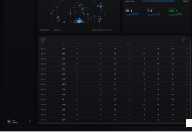

# 🏀 Hardwood — NBA Analytics

A live NBA analytics dashboard that pulls **real, up-to-the-minute data** — players, teams, standings, league leaders, and live box scores — straight from ESPN's free public API.

**No API keys. No build step. No backend. No hardcoded data.** It's a single HTML file that fetches everything live in your browser.



---

## ✨ What it does

Four interconnected dashboards, all driven by live data:

| Screen | What you get |
|--------|--------------|
| **Player** | The current league scoring leader by default — real headshot, PPG/RPG/APG/FG%/3P% with live league ranks, a percentile skill radar, a 15‑game performance trend, advanced shooting splits (TS%, eFG%, per‑36), and a full game log. |
| **Team dashboard** | Any team's record, seed, streak, point margin trend, league-ranked team shooting, full roster with per-player stats, and category leaders. |
| **League leaders** | Live Eastern/Western standings (W/L, PCT, GB, L10, streak) plus a sortable leaderboard (PPG, APG, RPG, SPG, BPG, 3P%). |
| **Live game** | The live game when one's on (auto-refreshes every 15s), otherwise the most recent final — with real quarter-by-quarter scores, full box score, win-probability chart, and odds. |

### Interactive features
- **🔎 Search any player** (press `⌘K` / `Ctrl+K`) — click a result to load their full profile. The Team dashboard automatically switches to that player's team.
- **Click any team** in the standings to open its dashboard.
- **Click any player** in a leaderboard or roster to open their profile.
- **Refresh** button to re-pull the latest data on demand.

---

## 🚀 How to run it

Because the app fetches data with `fetch()`, most browsers want it served over `http://` (opening the file directly with `file://` can block the requests). Running a tiny local server takes one command.

### Option A — Local server (recommended, works everywhere)

You need **Python 3** (pre-installed on macOS and most Linux; on Windows grab it from [python.org](https://www.python.org/downloads/)).

```bash
# 1. clone the repo
git clone https://github.com/Naut1cal5/hardwood-nba-analytics.git
cd hardwood-nba-analytics

# 2. start a local server
python3 -m http.server 8753

# 3. open this in your browser
#    http://localhost:8753/NBA%20Stats.html
```

Then visit **http://localhost:8753/NBA%20Stats.html** and you're done.

To stop the server, press `Ctrl+C` in the terminal (or `lsof -ti tcp:8753 | xargs kill` on macOS/Linux).

> Prefer Node? `npx serve .` then open the `NBA Stats.html` link it prints.

### Option B — One-click macOS launcher (`.command`)

On a Mac you can make a double-clickable shortcut. Create a file on your Desktop called **`Run NBA Stats.command`** with this content (change the path to where you cloned the repo):

```bash
#!/bin/bash
cd "$HOME/hardwood-nba-analytics" || exit 1
PORT=8753
lsof -ti tcp:$PORT >/dev/null 2>&1 || nohup python3 -m http.server $PORT >/dev/null 2>&1 &
sleep 1
open "http://localhost:$PORT/NBA%20Stats.html"
echo "Running at http://localhost:$PORT/NBA%20Stats.html"
echo "To stop:  lsof -ti tcp:$PORT | xargs kill"
```

Then make it executable once:

```bash
chmod +x ~/Desktop/"Run NBA Stats.command"
```

Now double-click it any time to launch the app. The first launch may prompt *"unidentified developer"* — right‑click → **Open** once to allow it.

---

## 🧠 How it works

- **Single file, zero build:** `NBA Stats.html` loads React 18 and [Babel standalone](https://babeljs.io/docs/babel-standalone) from a CDN and compiles the embedded JSX in the browser. There is nothing to install or compile ahead of time.
- **Live data layer:** `data.jsx` fetches and caches everything from ESPN's free, key‑less, CORS‑enabled endpoints, then maps it into the shapes each screen needs. A `<DataProvider>` React context exposes the data plus `selectPlayer()` / `selectTeam()` actions, with automatic retries so a flaky request never breaks a load.
- **Honest stats:** every number shown is real. Metrics ESPN doesn't expose directly (TS%, eFG%, per‑36, league percentiles, team four‑factors) are **computed from real box‑score totals** — nothing is invented. The shot chart's locations are modeled from the player's real shooting splits (free APIs don't publish shot coordinates) and labeled as such.

### Data sources (all free, no key)
- `…/basketball/nba/scoreboard` — today's games / live scores
- `…/statistics/byathlete` — every player's season stats (powers leaders, search, rosters)
- `…/standings` — conference standings
- `…/athletes/{id}/gamelog` — per‑game logs
- `…/summary?event={id}` — box score, win probability, odds
- `…/teams/{id}` — team colors & logos

---

## 🗂 Project structure

```
NBA Stats.html      ← the app (open this) — generated, contains the bundled JSX
build.py            ← re-bundles the .jsx files into the HTML after edits

data.jsx            ← live ESPN data layer + React context (DataProvider/useData)
app.jsx             ← shell: sidebar, routing, search overlay, loading/error states
player.jsx          ← Player profile screen
team.jsx            ← Team dashboard screen
leaders.jsx         ← Standings + league leaders screen
live.jsx            ← Live game screen
charts.jsx          ← reusable SVG charts (radar, line, donut, shot chart, win-prob…)
icons.jsx           ← inline SVG icons
tweaks-panel.jsx    ← the appearance tweak panel
```

### Editing the app
The `.jsx` files are the source of truth. After editing any of them, regenerate the HTML:

```bash
python3 build.py
```

Then refresh the browser.

---

## 🛠 Tech

- **React 18** (UMD build, via CDN)
- **Babel standalone** (in-browser JSX compilation)
- Pure **SVG** charts (no chart library)
- **ESPN public JSON API** for all data

---

## ⚠️ Disclaimer

This project uses ESPN's **unofficial/public** API endpoints for educational and personal use. It is **not affiliated with, endorsed by, or sponsored by ESPN or the NBA.** All team names, logos, and player data are property of their respective owners. Endpoints can change without notice.

## 📄 License

[MIT](LICENSE) — do whatever you like, no warranty.
